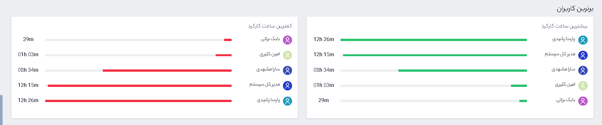

### داشبورد گروه

در این صفحه از داشبورد نمای کلی از اطلاعات ثبت شده از فعالیت گروه، سمت و یا دپارتمان مورد نظر توسط تایم¬نگر نمایش داده می‌شود، همچنین امکان دریافت اطلاعات در بازه زمانی مورد نظر شما در قالب فایل  PDF و PNG  وجود دارد.
 

 
تصویر شماره 1 – نمای داشبورد گروه

1.	با کلیک بر روی این آیکون، صفحه داشبورد گروه را مشاهده می‌کنید.

2.	در این قسمت می‌توانید کاربران، گروه‌ها، سمت‌ها و دپارتمان‌های مورد نظر خود را انتخاب کنید.

3.	بازه زمانی برای دریافت اطلاعات در این بخش انتخاب می‌شود.

4.	با کلیک بر روی این گزینه می‌توانید در قالب یک فایل  PDF یا یک تصویر PNG، اطلاعات موجود در صفحه داشبورد را دریافت کنید.
 

 
تصویر شماره 2 – نمای کلی

در این قسمت مجموع زمان پایش شده و مجموع زمان غیر کاربردی نمایش داده می‌شود.

 مجموع زمان پایش شده مدت زمانی از فعالیت‌ها می‌باشد که توسط نرم افزار تایم نگر ثبت شده است.
 
کل زمان غیر کاربردی مدت زمان پایش شده فعالیت‌هایی است که، در سایت‌ها و نرم افزارهای غیر کاربردی انجام شده است.

همچنین می‌توانید برترین پروژه‌ها به ازای زمان سپری شده برای آن‌ها را در این قسمت مشاهده کنید، پروژه‌ها تمامی آیتم هایی هستند که در کارتابل پیام‌گستر شما می¬باشند.
 

 
تصویر شماره 3 – آخرین داده‌ها

در آخرین داده ها شما می‌توانید لیستی از کاربرانی که آنلاین(وظیفه ای را شروع کرده اند) هستند و کاربرانی که در بازه‌ی زمانی مورد نظر آنلاین نشده‌اند و از تایم نگر استفاده نمی¬کنند، را مشاهده نمایید.

 
 
تصویر شماره 4 – پربازدید

در صورت داشتن عملکرد در بازه‌ زمان انتخابی، در بخش پر بازدید میزان ساعت ثبت شده در تایم نگر را به ازای هر روز هفته مشاهده می‌کنید، همچنین در نرخ بهینه عملکرد میزان فعالیت کاربردی، غیر کاربردی و خنثی نمایش داده می‌شود که این آمار مربوط به سایت¬ها و برنامه¬های استفاده شده کاربران مرتبط می¬باشد.

 
 
تصویر شماره 5 – برترین کاربران

در لیست برترین کاربران افرادی که بیشترین و کمترین  ساعت کارکرد را داشته باشند نمایش داده می‌شود.

 
تصویر شماره 6 – کار مفید / غیرمفید

در این قسمت افرادی را نمایش میدهد که بیشترین درصد کار مفید و غیر مفید  را داشتند.

 
 
تصویر شماره 7 – بیشترین زمان بیکاری

در این بخش افرادی که بیشترین زمان بیکاری را داشتند نمایش می‌دهد. 

 
تصویر شماره 8 – توقف تایم نگر

زمان بیکاری زمانی که کاربر حین فعالیت، از موس و کیبورد استفاده ای نکند، در بازه زمانی 15 دقیقه تایم نگر متوقف میشود و پس از آن پیغام بالا (تصویر شماره 8) نمایش داده می¬شود. در صورتی که گزینه "ادامه به کار" را کلیک نمایید، مدت زمان توقف تایم نگر، زمان بیکاری در نظر گرفته می¬شود. ولی درصورت انتخاب گزینه "استراحت"، پایان ساعت کاری در بازه مورد نظر به حساب می¬آید.

درصورتی که یکی از دکمه های استراحت یا ادامه به کار را تا پایان یک دقیقه انتخاب کند هیچ زمان بیکاری ثبت نخواهد شد در غیر اینصورت  از آن زمان تا آخرین فعالیت کاربر به عنوان زمان بیکاری ثبت خواهد شد.

 
 
تصویر شماره 9 – وبسایت‌ها و برنامه‌ها

میزان زمان سپری شده در وبسایت‌ها و برنامه‌های کاربردی و غیر کاربردی در این بخش نمایش داده می‌شود.

