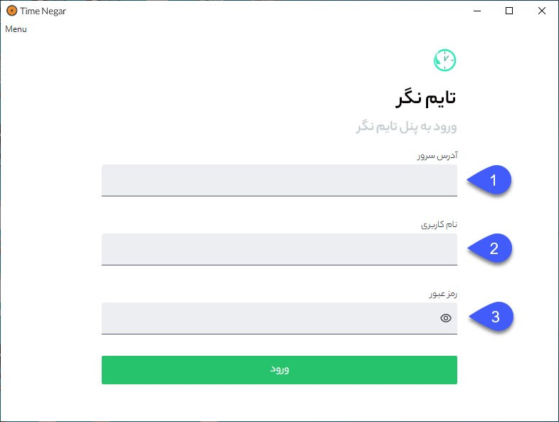
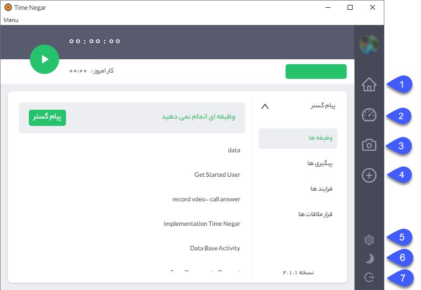
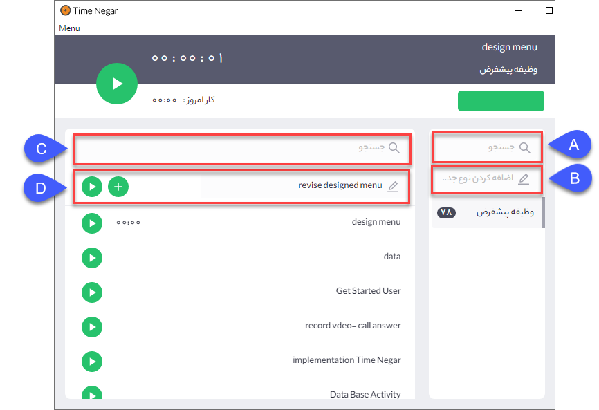

**دانلود تایم‌نگر**

جهت دانلود نرم‌افزار تایم‌نگر می‌بایست در crm  پیام‌گستر از مسیر دسترسی که در ادامه ذکر شده است، نسخه ویندوز و مک تایم‌نگر و افزونه تایم‌نگر برای مرورگر کروم را دانلود کنید. مسیر دسترسی : راهنما > اپ سنتر

پس از دانلود ، بمنظور نصب تایم نگر طبق مراحل ذکر شده عمل کنید:

در صورت خریداری ماژول تایم نگر می‌توان تایم نگر را با نرم‌افزارهای CRM پیامگستر،Azure Devops Server (TFS) ، Trello وJira Atlassian متصل کرد. 

**نصب نرم‌افزار تایم نگر**

پس از اجرا فایل نصب نرم‌افزار، صفحه زیر باز خواهد شد.

جهت ورود به نرم‌افزار آدرس سرور، نام کاربری و رمز عبور را را وارد کنید.

1. **آدرس سرور:** آدرس سرور خود را وارد کنید.

2. **نام کاربری:** نام کاربری پیامگستر را وارد کنید.

3. **رمز عبور:** رمز عبور پیامگستر را وارد کنید.

پس از ورود به نرم‌افزار تمامی آیتمهای جاری در کارتابل پیامگستر برای کاربر قابل مشاهده بوده و برای شروع فعالیت لازم است یکی از پروژهها انتخاب گردد.

1. **خانه:** با کلیک بر روی خانه وارد صفحه اصلی نرم‌افزار تایم نگر می‌شوید. 

2. **داشبورد:** این قسمت داشبورد فعالیت¬های شما را نمایش می¬دهد که در بخش داشبورد جزئیات آن شرح داده شده است.

3. **تصاویر:** این قسمت تصاویر گرفته شده از صفحه نمایشگر کامپیوتر شما را نمایش می¬دهد که جزئیات آن در بخش تصاویر شرح داده شده است.

4.  **افزودن تسک:** در این صفحه می‌توان بدون نیاز به ورود به CRM پیام‌گستر، زیرنوع آیتم یا وظیفه جدیدی را مستقیم از نرم‌افزار تایم نگر ایجاد کرد.
 

A: در قسمت جست و جو می‌توان زیرنوع وظیفه مورد نظر برای ایجاد را جست و جو کرد.

B: در صورت داشتن مجوز شخصی‌سازی از آن آیتم، می‌توان از این قسمت زیر نوع جدید وظیفه را ایجاد کرد.

C: در این قسمت می‌توان وظیفه‌هایی که قبلا ایجاد شده بودند را جست و جو کرد.

D: درصورت داشتن مجوز ذخیره از آیتم وظیفه مورد نظر، می‌توان وظیفه جدید را ایجاد و شروع کرد. 

5. **نوار فعالیت:** با انتخاب نوار فعالیت، نواری در پایین صفحه برای کاربر نمایش داده می‌شود و می‌توان ساعت فعالیت را بدون نیاز به ورود به نرم‌افزار مشاهده، وظیفه را متوقف و شروع کرد.

6. **حالت شب:** با این گزینه می‌توان نمایش حالت شب صفحه را فعال نمود.

7. **خروج:** با این گزینه می‌توان از نرم‌افزار خارج شد.

