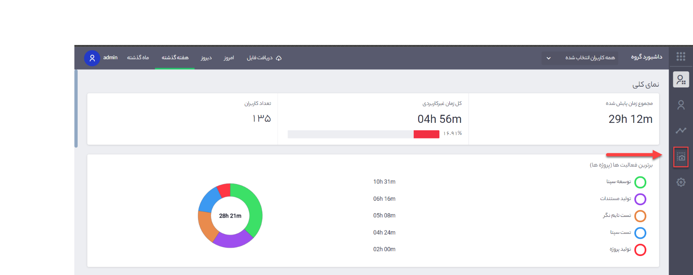
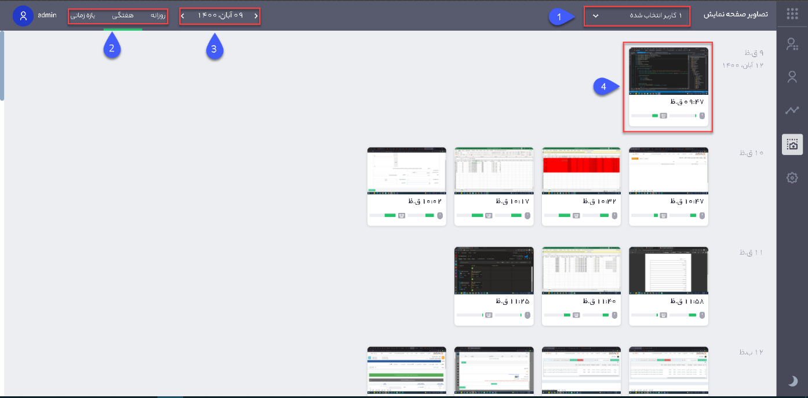

### تصاویر صفحه نمایش

از ویژگی‌های نرم افزار تایم نگر ثبت تصاویر صفحه نمایش کاربران از زمان شروع تا زمان پایان کار تایم نگر می‌باشد، نرم افزار تایم نگر به صورت خودکار در فواصل زمانی مشخص اقدام به عکسبرداری از صفحه نمایش کاربران می‌کند، شما می‌توانید تصاویر ثبت شده برای هر کاربر را در داشبورد تایم نگر مشاهده کنید. درصد استفاده از موس و کیبورد می تواند در کاربران با وظیفه های مختلف متفاوت باشد و کم بودن این اعداد احتمالا به معنای کم کاری از طرف کاربر نیست.
 
 
 
تصویر شماره 1 – نمای صفحه اصلی نرم‌افزار

برای مشاهده تصاویرگرفته شده از کاربران باید به بخش تصاویر صفحه نمایش (تصویر شماره 1) داشبورد نرم‌افزار وارد شوید.

 تصویر شماره 2 – تصاویر صفحه نمایش
 
1.	در این قسمت جهت نمایش تصاویر گرفته شده باید کاربر مورد نظر را انتخاب کنید.

2.	بازه زمانی مورد نظر برای نمایش تصاویر در این قسمت مشخص می‌شود.

3.	جهت دسترسی سریع‌تر می‌توانید در این قسمت روز خاصی را انتخاب کنید.

4.	با کلیک بر روی هر یک از تصاویر در سایز بزرگتر تصویر نمایش داده خواهد شد، همچنین اطلاعاتی مانند میزان استفاده از موس و کیبورد در بازه زمانی مشخص در پایین هر تصویر نمایش داده می‌شود.
