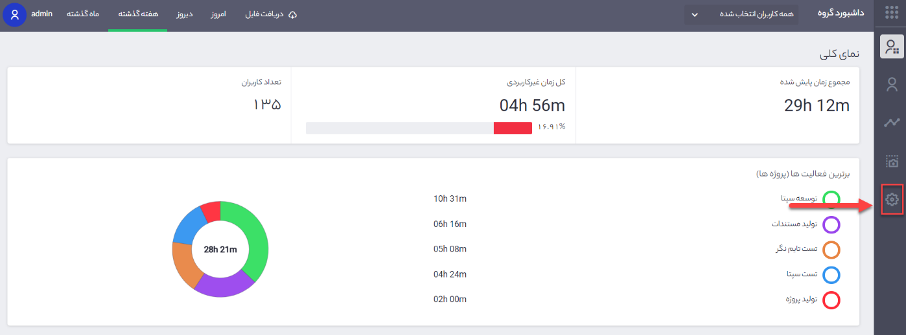
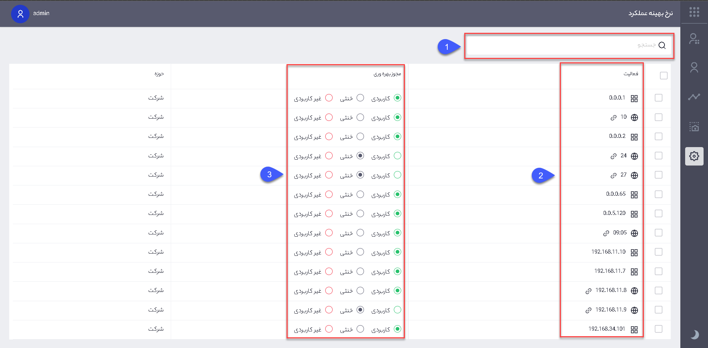

### مدیریت وبسایت‌ها و برنامه‌های کاربردی

یکی از امکانات ویژه نرم‌افزار تایم نگر تعریف وبسایت‌ها و نرم افزارها کاربردی و غیرکاربردی جهت نظارت دقیق بر عملکرد کاربران می‌باشد. شما می‌توانید برای هر یک از وبسایت‌ها و نرم افزارها وضعیت‌هایی تحت عنوان کاربردی، غیرکاربردی و خنثی تعیین نمایید تا در مدت زمان استفاده از تایم نگر، تمامی فعالیت کاربران ثبت شده و در قسمت داشبورد نرم افزار، گزارش مربوط به سایت ها و نرم افزارهای استفاده شده در بازه‌ی زمانی مورد نظر نمایش داده شود.

به منظور تعریف وضعیت کاربردی، غیرکاربرد و خنثی وبسایت‌ها و برنامه‌ها طبق مراحل زیر عمل می‌کنیم:
 
 
 
تصویر شماره 1 – نمای صفحه اصلی نرم‌افزار

با توجه به تصویر شماره 1  ابتدا باید از صفحه‌ی اصلی نرم‌افزار وارد بخش تنظیمات نرخ بهینه عملکرد شویم.
 
 
 
تصویر شماره 2 – مدیریت سایت‌ها و نرم‌افزارها

1. شما در این قسمت می‌توانید عنوان سایت یا نرم افزار را جهت دسترسی سریع‌تر جستجو کنید.

2. لیستی از وبسایت‌ها و نرم افزارهایی که تا به این لحظه کاربران استفاده کردند را مشاهده می¬کنید.

3. وضعیت سایت و یا نرم افزار مورد نظر (کاربردی، غیرکاربردی، خنثی) در این قسمت تعیین می‌شود، به خاطر داشته باشید در حالت اولیه وضعیت روی حالت خنثی قرار دارد و به این معنی است که فعالیت در این بخش¬ها از سمت سازمان اهمیت کاربردی و غیرکاربردی¬ای ندارد.

اگر وضعیت کاربردی بودن سایت یا نرم افزاری تغییر کند وضعیت جدید روی اطلاعات قبلی اعمال خواهد شد.
