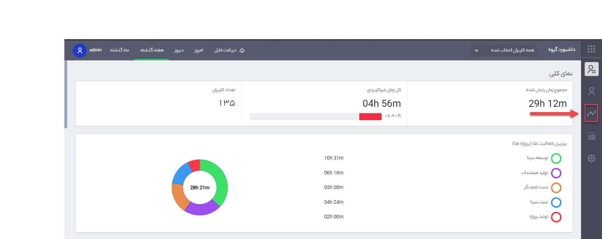
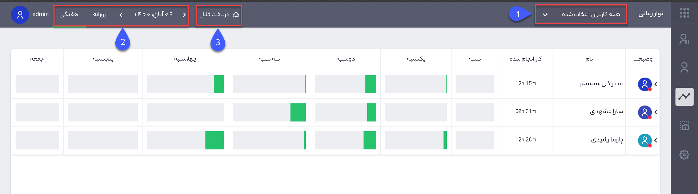
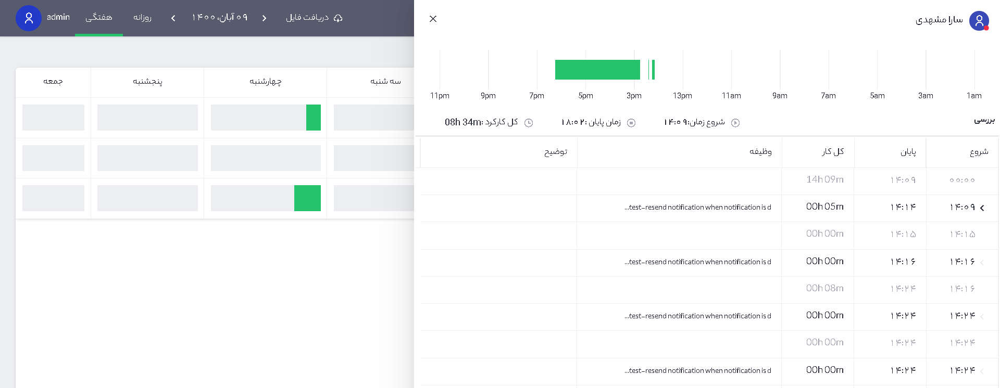
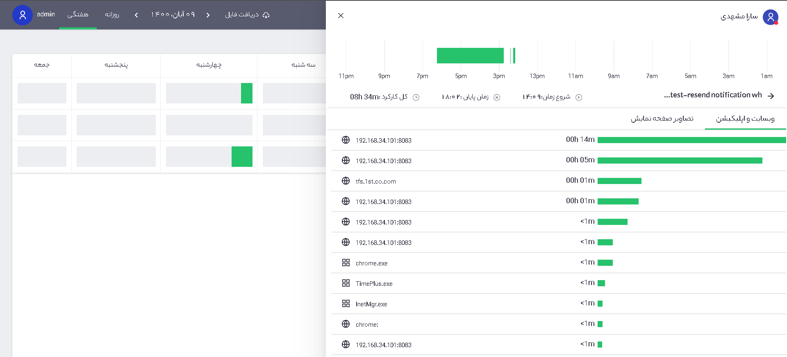
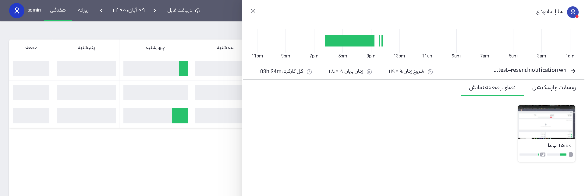

تحلیل نوار زمانی

جهت تشخیص دقیقتر عملکرد هر یک از کاربران در روز و زمان مشخص، می¬توانید از نوار زمانی استفاده نمایید. در این بخش بازه¬های شروع و پایان فعالیت¬های کاربران را به صورت فیلتر روزانه یا هفتگی می¬توان در اختیار داشت. همچنین با کلیک بر هر نوار فعالیت (قست سبز رنگ) می¬توان میزان زمان سپری شده برای فعالیت‌های مختلف و تصاویر گرفته شده از صفحه نمایش در بازه‌های زمانی مورد نظر را مشاهده نمود.

برای دسترسی به نوار زمانی از صفحه اصلی روی نوار زمانی کلیک کنید (تصویر شماره 1).
 
 
 
تصویر شماره 1 – نمای صفحه اصلی نرم‌افزار

 
تصویر شماره 2 – نوار زمانی

در این صفحه کار انجام شده کاربران را در بازه‌ی زمانی مورد نظر مشاهده می‌کنید که زمان درج شده در ستون "کار انجام شده"، مجموع کل زمان فعالیت کاربر در بازه‌ی انتخابی می¬باشد. (تصویر شماره 2).

1.	در این قسمت افراد مورد نظر را انتخاب کنید.

2.	بازه زمانی در این قسمت تعیین می‌شود.

3.	از طریق دریافت فایل می‌توانید از اطلاعات خروجی فایل اکسل دریافت کنید.

فیلد زمان کل به معنی کل زمان های کارشده و نشده بین زمان شروع و پایان است 

با کلیک بر روی هر یک از نوارهای زمانی اطلاعات مرتبط در آن بازه‌ی زمانی نمایش داده میشود، زمان شروع و پایان تایم نگر و میزان کل کارکرد را میتوانید به ازای هر یک از پروژه¬ها (وظایف) مشاهده کنید.

 
تصویر شماره 3 – نوار زمانی

با کلیک بر روی هر یک از وظایف شما می‌توانید سایت و برنامه‌هایی که در آن بازه استفاده شده و میزان زمان سپری شده روی هر یک  را مشاهده نمایید. (تصویر شماره 4).

 
تصویر شماره 4 – نوار زمانی

همچنین تصاویر گرفته شده در آن بازه‌ی زمانی به همراه میزان استفاده از موس و کیبورد نیز در تصاویر صفحه نمایش قابل مشاهده می‌باشد (تصویر شماره 5).

 
تصویر شماره 5 – نوار زمانی
