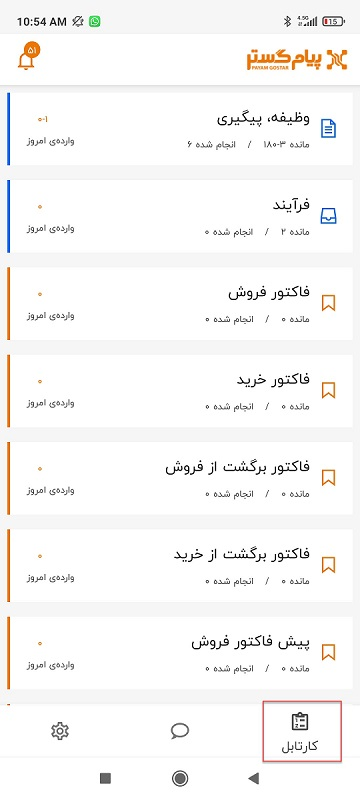
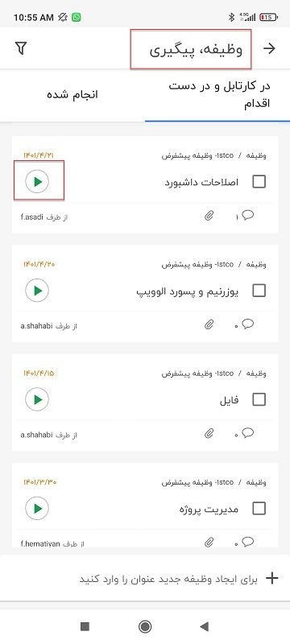
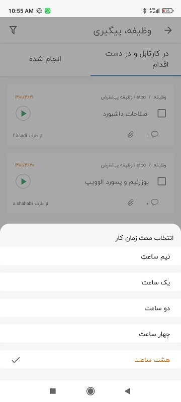
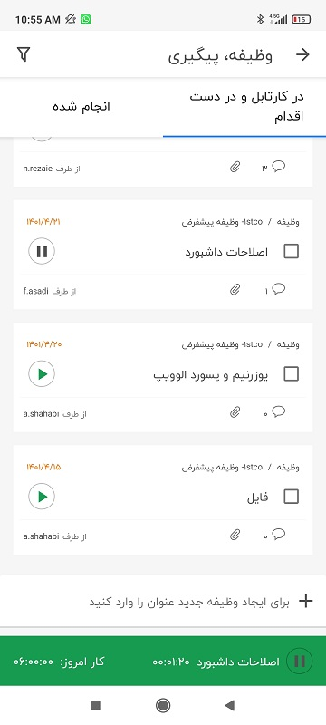
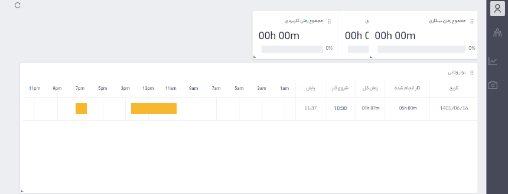

# شروع و توقف آیتم‌های در کارتابل فرآیند، قرارملاقات، وظیفه و پیگیری در نسخه موبایل

می‌توانید ماژول تایم‌نگر را علاوه بر نسخه تحت وب بر روی اپلیکشن موبایل نیز استفاده کنید و وظیفه‌ها، فرآیندها، پیگیری‌ها و قرارملاقات‌ها را از روی موبایل شروع (PLAY) و متوقف کرد. برای استفاده از تایم‌نگر در گوشی طبق مراحل زیر عمل کنید:

1-	در نرم‌افزار موبایل وارد کارتابل شوید.

2-	کارتابل مورد نظر را انتخاب کنید. بعنوان مثال در اینجا کارتابل وظیفه و پیگیری انتخاب شده است.

3-	پروژه‌ای که می‌خواهید بر روی آن کار کنید را انتخاب و بر روی علامت play سبز رنگ کلیک کنید.

4-	مدت زمان کار را انتخاب کنید. در نسخه موبایل، نرم‌افزار همانند نسخه تحت وب بعد از 20 دقیقه فعالیت نداشتن متوقف نمی‌شود و در این مرحله لازم است زمان توقف مشخص شود. بصورت پیش فرض زمان 8 ساعت انتخاب شده است و شما می‌توانید از بین زمان‌های نیم ساعت، 1 ساعت، 2 ساعت، چهار ساعت و 8 ساعت یک را انتخاب کنید.
 

5-	با شروع کار بر روی آیتم نوار سبز رنگی برای نمایش مدت زمان سپری شده نمایش داده می‌شود که می‌توانید آن را متوقف و مجددا شروع نمایید. 
 

6-	برای مشاهده گزارش کار مربوطه، وارد داشبورد تایم‌نگر شوید و در قسمت نوار زمانی مدت زمانی که وظیفه یا پیگیری از گوشی play شده است را به رنگ نارنجی مشاهده می‌کنید.

