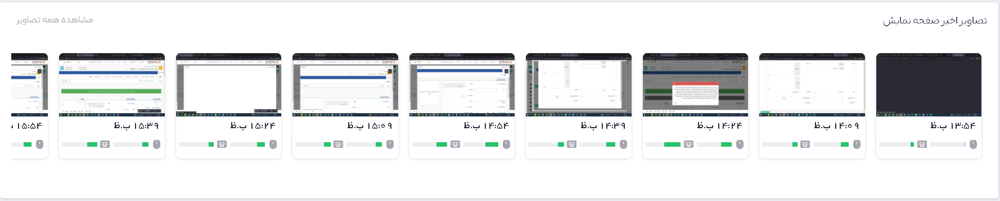

### داشبورد کاربر

در این قسمت از تایم نگر نمای کلی از اطلاعات ثبت شده هر کاربر را مشاهده می‌کنید.

مجموع زمان پایش شده مدت زمان سپری شده از فعالیت‌های کاربران است که توسط نرم افزار تایم نگر ثبت شده است. 

مجموع زمان خنثی از مجموع زمان پایش شده فعالیت‌ها ای بدست می‌آید که در بخش سایت‌ها و نرم افزارها در حالت خنثی قرار دارند.

مجموع زمان غیر کاربردی از مجموع زمان پایش شده فعالیت‌ها ای بدست می‌آید که در بخش سایت‌ها و نرم افزارها در حالت غیر کاربردی قرار دارند.

مجموع زمان کاربردی از مجموع زمان پایش شده فعالیت‌ها ای بدست می‌آید که در بخش سایت‌ها و نرم افزارها در حالت کاربردی قرار دارند.

مجموع زمان بیکاری از زمان‌های پایش شده‌ای بدست می‌آید که کاربر در آن بازه‌ی زمانی فعالیتی نداشته و برنامه تایم تگر متوقف شده و مجددا فعال شده است.

زمان بیکاری: زمانی که یک کاربر کار می‌کند ولی هیچ فعالیتی با موس و کیبورد انجام نمی‌دهد این زمان به عنوان زمان بیکاری نیز ثبت می‌شود. این به معنی کم کاری از سمت کاربر نیست و می تواند تا اندازه‌ای برای کاربران با وظایف متفاوت قابل چشم پوشی باشد.

 
	تصویر شماره 1 – نمای داشبورد کاربر
	
1.	با کلیک بر روی این آیکن، صفحه داشبورد کاربر را مشاهده می¬نمایید.

2.	در این قسمت می‌توانید کاربر مورد نظر خود را انتخاب کنید.

3.	بازه زمانی برای دریافت اطلاعات از این قسمت تعیین کنید.

4.	با کلیک بر روی گزینه دریافت فایل می‌توانید خروجی‌ای در قالب فایل  PDF یا یک تصویر از صفحه داشبورد کاربر دریافت کنید.

تصویر شماره 2 – اطلاعات زمان کارکرد

در این قسمت میزان زمان سپری شده در حالت های مختلف توسط کاربر نمایش داده می‌شود همچنین شما می‌توانید میزان کار انجام شده در زمان‌های مختلف طی روز را مشاهده کنید.

 
 
تصویر شماره 3 – ساعت‌های ردیابی شده

میزان ساعت ثبت شده در نرم افزار در روزهای مختلف در این قسمت نمایش داده می‌شود.

تصویر شماره 4 – نرخ بهینه عملکرد 
در نرخ بهینه عملکرد شما نموداری را به ازای هر روز که تشکیل شده از مجموع زمان‌های کاربردی، غیر کاربردی و خنثی مشاهده می‌کنید.

 
تصویر شماره 5 – تصاویر صفحه نمایش

آخرین تصاویر صفحه نمایش گرفته شده از کاربر در این قسمت نمایش داده می‌شود.

 
تصویر شماره 6  – وبسایت‌ها و برنامه‌های کاربردی

با توجه به تنظیمات  نرخ بهینه عملکرد، برنامه و وبسایت‌های کاربردی / غیر کاربردی  و همچنین میزان زمان سپری شده برای هر یک را مشاهده می‌کنید.

 
تصویر شماره 7  – برترین فعالیت‌ها

برترین پروژه‌ها و وظایف با توجه به میزان زمان سپری شده برای هر یک در این قسمت نمایش داده می‌شود.
